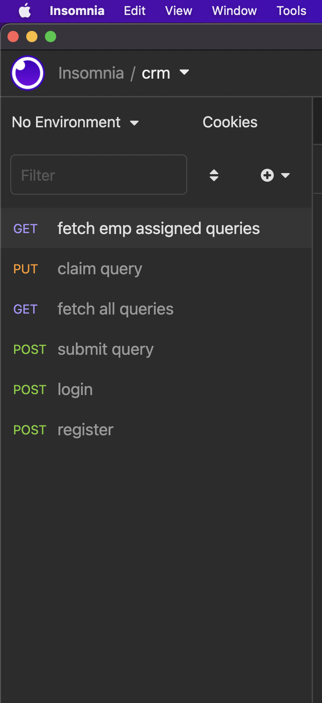

# CRM REST APIS
 - API for Employee login/register.
 - Public form API must be accessible without any authentication.
 - API to claim leads.
 - API to fetch unclaimed leads.
 - API to fetch leads claimed by logged in users.

 ### following packages are used.

 * express
 * mongoose
 * jasonwebtoken
   

## This is list of apis.
 

